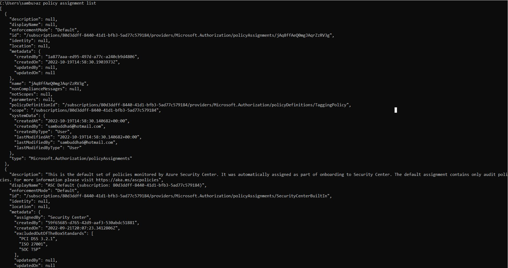

# Azure Infrastructure Operations Project: Deploying a scalable IaaS web server in Azure

### Introduction
For this project, you will write a Packer template and a Terraform template to deploy a customizable, scalable web server in Azure.

### Dependencies
1. Create an [Azure Account](https://portal.azure.com) 
2. Install the [Azure command line interface](https://docs.microsoft.com/en-us/cli/azure/install-azure-cli?view=azure-cli-latest)
3. Install [Packer](https://www.packer.io/downloads)
4. Install [Terraform](https://www.terraform.io/downloads.html)

### Instructions
1. After the installations are done we need to make sure the terraform and packer exe files are in the same folder and update the system's global path to that path
2. Add the updated server.json, policy.json, main.tf and vars.tf in the same folder
3. Run 'az image list' to see if any vm images are existing 
4. Run 'packer build server.json' on the updated json file in the repo
5. After successful completion of the above command run 'az image list' again and this should show similar output as Output #1
6. Run 'az policy definition create --name TaggingPolicy --rules policy.json'
7. Output should be similar to Output #2
8. Run 'az policy assignment create --policy TaggingPolicy'
9. Run 'az policy assignment list' which looks like below
     
10. Run 'terraform init' and it should give a success message as 'Terraform has been successfully initialized!'
11. Run 'terraform plan -out solution.plan' and it should give a message like Output #3
12. The above command should prompt for number of virtual machines like below
    var.vm_count
    The number of Virtual Machines

    Enter a value:
13. Generically to prompt user input for any variable defined in the vars.tf file, delete the default value, currently for vm_count variable the default value is removded
14. Once the terraform plan command is successful check if the file 'solution.plan is created 
15. Run 'terraform apply "solution.plan"' to create the resources - upon successful completion it should give the message 'Apply complete! Resources: 14 added, 0 changed, 0 destroyed.'
16. Run 'terraform show' to see the resources created and it should give a message like Output #4
17. Run 'terraform destroy' to delete the resources created 
18. Run 'terraform show' to confirmed the resources have been destroyed
19. Run 'az image delete -g cloud-shell-storage-centralindia -n myPackerImage' to delete the packer image
20. Run 'az image list' to confirm if the packer image is deleted

### Output
1. Refer to the file in the repo 'output az image list'
2. Refer to the file in the repo 'output az policy definition create' 
3. Refer to the file in the repo 'output terraform plan'
4. Refer to the file in the repo 'output terraform show' 
